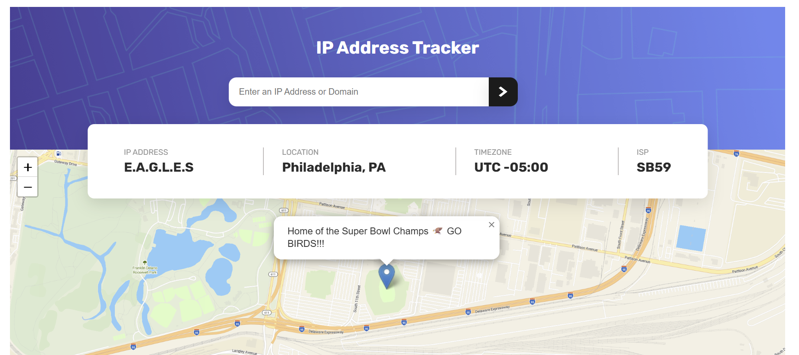

# React IP Address Tracker

Welcome to my solution for the IP Address Tracker, this time written in React. Enter whatever valid IP address or domain address and fly to it almost instantly.

- [React IP Address Tracker](#react-ip-address-tracker)
  - [Overview](#overview)
    - [The challenge](#the-challenge)
    - [Screenshot](#screenshot)
    - [Links](#links)
    - [My process](#my-process)
    - [Built with](#built-with)
    - [What I learned, a reflection](#what-i-learned-a-reflection)
    - [Resources](#resources)
- [React + TypeScript + Vite](#react--typescript--vite)
  - [Expanding the ESLint configuration](#expanding-the-eslint-configuration)

## Overview

The purpose of this project was to utilize React.js to replicate am IP Address tracker that takes a user input of an ip address or domain address, validates the input, and fetches the information from an api from ipify, and use that with another api call to leaflet in order to display the coordinates. 

### The challenge

Users should be able to:

- View the optimal layout for each page depending on their device's screen size
- See hover states for all interactive elements on the page
- See the IP address of the Superbowl Champions on the map on the initial page load
- Search for any IP addresses or domains and see the key information and location

### Screenshot



### Links

Netlify Deplyment: https://famous-nougat-fb1d6f.netlify.app/

### My process 

After doing an initial mapping(this will be provided in the resources section at the end of the project), I proceeded to begin building the components necessary to render the data on the page. First the search form, then the results display, and I finished with the map display component. 

From there I imported the previous error handler from html, css and ts implementation of this project. I was then able to wire up the api service to the search form, with the idea to use the search form to test the api call. I then went on to create the apiService call, making an interface to shape the data, and pass as props to the map display and results display. The last portion of the ipify centered api call was setting up the sults display to organize the information passed from the api call. I wasn't too concerned with the accuracy of design here, but rather creating a space for the information to show. 

The Map display came next, and gave me my biggest issue I faced on the project(Aside from styling). Rather utilizing cdn links in this project, I opted for the package version of leaflet. And while that made things a little easier in terms of creating the items needed, like the map, popup and marker, implementing them was a little different and where the map loaded more smoothly afte rthe issues i faced in the first implementation, this time around it came in block and choppy. After some time searching around, I found my issue was that i did not have the css imported. And then I had some issues because i went over kill, imported the file and put the link in the html, realized they were conflicting, and then stuck with the import from the leaflet package. 

Once the map was properly set up, the api working and passing the information and displaying it, then came time for styling. I definitely could have leveraged bootstraps functionality a lit better, but i kind of like how the element names are more descriptive, and then you can leverage css to be a little more particular in your design. I definitely still have some work to do in finding my definitive work flow in styling, but I am leaning in that direction. 

### Built with

- React.ts
- CSS custom properties
- Vite


### What I learned, a reflection

I can say the very first thing I learned in this implentation of this project, is that I understand why React is so popular. It makes the construction of your application much easier in terms of keeping track of everything. The ability to limit concern about proper html page construction because of jsx helped a lot. 

I am stil learning the importance of proper planning when tackling a project, and I think i imporved a bit here but still have some room to grow. Particularly in taking the time to do proper flow charts to help guide the process. I get concerned with overthinking it, and then in my last project i underthought it, and after many conversations with my dad who's been a software engineer since the late 90's, I'm gonna really hunker down on creating proper flow charts in order to achieve projects like this in the future. I considered more the flow of this project, but it's simplicity alos helped to visulaize the flow. 

Another learning point for me on this was my approach to styling. I definitely need to take some time to consider what my approach truly is. As i stated in my process, i kind of like the idea of leveraging react bootstraps syntax, but getting particular in the styling in css. 

### Resources

I just want to make note that these are my set up notes, and I prefer to share them as I wrote them, as the idea is to give a little insight into my thinking as I attack these projects. I apologize if anything seems weirdly phrased or incoherent, this is why. 

React IP Address Tracker:

User flow:

User will load the page, and see a background that includes an image(provided) that takes up around 25% of the background, and the bottom 75 is the map from leaflet. In that Map is a popup that will have a popup pin and message showing the location, and the ip address and the location. 

The user will see a header with the name ip address tracker  a search bar with the placeholder "Enter any ip address or domain" and a button with an arrow to initiate the search. 

Under that will be a container that displays ip address, location, timezone, and isp, all received from an api call to ipify. 


converting from previous projects:

While the goal is the same, react will greatly vary the implementation in terms of folder and file structure(and obviously some syntax)

First, the use of components

App - main wrapper, will hold state for ip tracker and the fetch logic
header - will display title
ip form - the input field and submit button with handlers
results display - the container showing ip location timezone and isp, props for this will be the data that is fetched
map display - the leaflet map, which will focus o nthe ip location. this will take lat and long as props
footer - the frontend mentor thing with my name

Styling

For this I'll be pulling in react-bootstrap and react-leaflet to handle most of the styling. Some css maybe used for fine tuning if needed. 


models

i can convert my ip-info into just an interface, and the com cache is o longer pertinent

services

the ip api service will now be using just an interface(displayDetails was more a debugger than anything). Rather than new Location(creating a new class instance from the data) we'll just create a new object, IP_Info shaped by the props in the interface. 
using react-leaflet will also change map service a little(like not having to declare l, and the popup and marker will be handled differently). I can also use react state and props to handle 

utils

this can honestly just be brought in verbatim, it will just be used a little differently

main.ts

the big thing with this, is no dom apis now. 
window.addevent listener - useEffect

comCahce.ipForm.addeventlis - onsubmit which will use useState

domCache.+.textCintent - the ip info will be stored in state(ipData) and render by props in results display

alert - bootstraps alert will handle this(though i may do a not found page depending on time.)

To start 

Let's try the components again, dont go nuts, just have a map of the pieces you will be using.
input form
results display
map display
These encompass everything on the page. They will then all be used in app, maintaining state in app.tsx
The components can be set up with the idea of the data they will need in order to function as intended. 
After things are set on the page, I can then go and complete the logic to receive the necessary information. 
With that that information, I can then pass it to my components and do the fine tuning necessary for styling. 

Resources:

https://react-leaflet.js.org/docs/start-introduction/
https://react-bootstrap.netlify.app/
https://docs.maptiler.com/cloud/api/
https://geo.ipify.org/docs
IP_Address_Tracker in repo
https://react-typescript-cheatsheet.netlify.app/docs/basic/setup
https://www.typescriptlang.org/docs/handbook/react.html
https://stackoverflow.com/questions/79583508/map-does-not-load-properly-using-react-leaflet
https://stackblitz.com/edit/react-leaflet-v5?file=README.md
https://vite.dev/guide/env-and-mode.html


 


# React + TypeScript + Vite

This template provides a minimal setup to get React working in Vite with HMR and some ESLint rules.

Currently, two official plugins are available:

- [@vitejs/plugin-react](https://github.com/vitejs/vite-plugin-react/blob/main/packages/plugin-react) uses [Babel](https://babeljs.io/) for Fast Refresh
- [@vitejs/plugin-react-swc](https://github.com/vitejs/vite-plugin-react/blob/main/packages/plugin-react-swc) uses [SWC](https://swc.rs/) for Fast Refresh

## Expanding the ESLint configuration

If you are developing a production application, we recommend updating the configuration to enable type-aware lint rules:

```js
export default tseslint.config([
  globalIgnores(['dist']),
  {
    files: ['**/*.{ts,tsx}'],
    extends: [
      // Other configs...

      // Remove tseslint.configs.recommended and replace with this
      ...tseslint.configs.recommendedTypeChecked,
      // Alternatively, use this for stricter rules
      ...tseslint.configs.strictTypeChecked,
      // Optionally, add this for stylistic rules
      ...tseslint.configs.stylisticTypeChecked,

      // Other configs...
    ],
    languageOptions: {
      parserOptions: {
        project: ['./tsconfig.node.json', './tsconfig.app.json'],
        tsconfigRootDir: import.meta.dirname,
      },
      // other options...
    },
  },
])
```

You can also install [eslint-plugin-react-x](https://github.com/Rel1cx/eslint-react/tree/main/packages/plugins/eslint-plugin-react-x) and [eslint-plugin-react-dom](https://github.com/Rel1cx/eslint-react/tree/main/packages/plugins/eslint-plugin-react-dom) for React-specific lint rules:

```js
// eslint.config.js
import reactX from 'eslint-plugin-react-x'
import reactDom from 'eslint-plugin-react-dom'

export default tseslint.config([
  globalIgnores(['dist']),
  {
    files: ['**/*.{ts,tsx}'],
    extends: [
      // Other configs...
      // Enable lint rules for React
      reactX.configs['recommended-typescript'],
      // Enable lint rules for React DOM
      reactDom.configs.recommended,
    ],
    languageOptions: {
      parserOptions: {
        project: ['./tsconfig.node.json', './tsconfig.app.json'],
        tsconfigRootDir: import.meta.dirname,
      },
      // other options...
    },
  },
])
```
